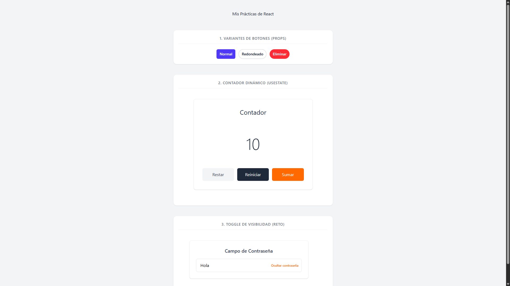
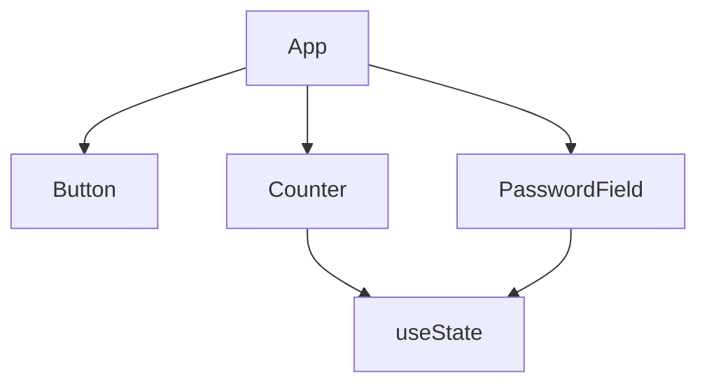

# ⚛️ React + TypeScript Component Architecture
### Arquitectura de Componentes con React + TypeScript

Proyecto enfocado en la creación de interfaces modernas, reutilizables y escalables utilizando React, TypeScript y Tailwind CSS.

Project focused on building modern, reusable, and scalable interfaces using React, TypeScript, and Tailwind CSS.

---

## ✨ Features | Características

- 🧩 Arquitectura modular / Modular architecture
- 🔒 TypeScript con tipado estricto / Strict TypeScript typing
- 🎨 Tailwind CSS para estilos dinámicos / Dynamic styling with Tailwind CSS
- 🧱 Composición avanzada de componentes / Advanced component composition
- ⚡ Vite para desarrollo rápido / Fast development environment with Vite
- 🪝 React Hooks (`useState`) / React Hooks integration
- 🔢 Contador interactivo / Interactive counter component
- 👁️ Toggle dinámico de contraseña / Dynamic password visibility toggle

---

## 📸 Preview | Vista Previa



---

## 📁 Project Structure | Estructura del Proyecto

```
src/
│
├── components/
│   ├── Button/
│   │   ├── Button.tsx
│   │   ├── Button.types.ts
│   │   └── Button.styles.ts
│   │
│   ├── Counter/
│   │   ├── Counter.tsx
│   │   └── Counter.types.ts
│   │
│   ├── PasswordField/
│   │   ├── PasswordField.tsx
│   │   └── PasswordField.types.ts
│
├── pages/
├── hooks/
├── styles/
└── main.tsx
```

---

## 📊 Component Architecture | Arquitectura de Componentes



---

## 🛠️ Technologies | Tecnologías

| Frontend | Styling | Tooling |
|---|---|---|
| React | Tailwind CSS | Vite |
| TypeScript | CSS Modules | npm |

---

## 📦 Installation | Instalación

### Clone repository | Clonar repositorio

```bash
git clone <repository-url>
```

### Install dependencies | Instalar dependencias

```bash
npm install
```

### Start development server | Iniciar entorno de desarrollo

```bash
npm run dev
```

---

## 🧩 Included Components | Componentes Incluidos

### 🔘 Button Component

Reusable button component with visual variants and custom props.

Componente reutilizable de botones con variantes visuales y props personalizadas.

| Variant | Description |
|---|---|
| `primary` | Main application style |
| `outline` | Secondary bordered style |
| `destructive` | Alert/delete style |
| `rounded` | Capsule-style rounded borders |

---

### 🔢 Counter Component

Interactive counter built with `useState`.

Contador interactivo construido con `useState`.

Features:
- Increment
- Decrement
- Reset state

---

### 👁️ Password Toggle Component

Dynamic password visibility field using React state.

Campo dinámico para mostrar u ocultar contraseñas utilizando estado en React.

Features:
- Show password
- Hide password
- Dynamic input type switching

---

## 💡 Usage Example | Ejemplo de Uso

```tsx
<Button variant="primary">
  Click me
</Button>

<Counter />

<PasswordField />
```

---

## 📄 License | Licencia

GNU General Public License v3.0 (GPL-3.0)

https://www.gnu.org/licenses/gpl-3.0.html

---

## 👨‍💻 Author | Autor

Jesús Blanco Andrade